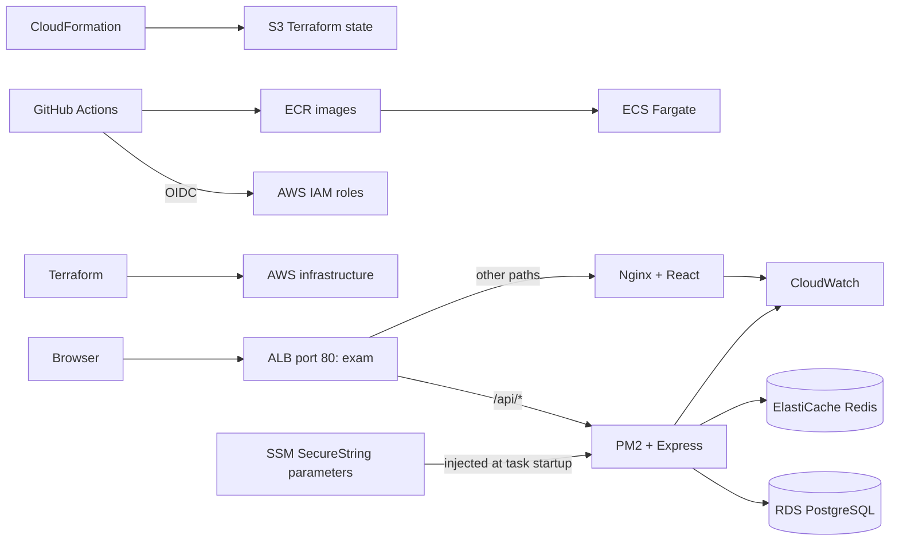

# Smart Canteen: exam deployment

## Tool responsibilities

| Tool | What it demonstrates | Source |
|---|---|---|
| GitHub Actions | CI, container publishing, deployment | `.github/workflows/` in each repository |
| CloudFormation (CFT) | Bootstrap state storage and GitHub OIDC | `cloudformation/bootstrap.json` |
| Terraform | VPC, subnets, security groups, ECR, ECS, ALB, RDS, Redis, IAM, monitoring | `terraform/` |
| Docker | Repeatable API and frontend images | Each repository's `Dockerfile` |
| ECS Fargate | Container scheduling and rolling releases | `terraform/ecs.tf` |
| ALB | Frontend/API path routing and target health | `terraform/alb.tf` |
| RDS PostgreSQL | Persistent relational data | `terraform/data.tf` |
| SSM Parameter Store | Encrypted `SecureString` credentials | `scripts/init_exam_secrets.py` |
| Ansible | Migration-first backend release and health checks | `ansible/deploy.yml` |
| Nginx | Frontend serving, runtime configuration, access logs | `Frontend/nginx.conf` |
| PM2 | API process supervision and restart | `Backend/ecosystem.config.cjs` |
| CloudWatch | Logs, dashboard, Container Insights, alarm states | `terraform/monitoring.tf` |



ECS owns containers; PM2 owns the Node process inside the API container. There is one Node process per task, and ECS handles horizontal replication. CloudFormation owns bootstrap resources; Terraform owns application resources. No resource is managed by both tools. Kubernetes is excluded.

## Prerequisites

- Follow [AWS_SETUP.md](AWS_SETUP.md); the local AWS profile is `smartcanteen`.
- AWS CLI v2, Terraform 1.11.4+, Python 3.11+, Docker, Node.js 22 and pnpm 10.30.3.
- Session Manager plugin for `aws ecs execute-command`.
- Push the changes to the two existing GitHub repositories after reviewing them.
- Use Mumbai (`ap-south-1`). Infrastructure incurs AWS charges; the exam profile uses one NAT gateway, one RDS instance and one Redis node. It is not highly available.

## 1. Bootstrap with CloudFormation

From `Backend/`:

```sh
export AWS_PROFILE=smartcanteen
export AWS_REGION=ap-south-1
aws sts get-caller-identity
aws cloudformation deploy \
  --stack-name smartcanteen-bootstrap \
  --template-file infra/cloudformation/bootstrap.json \
  --capabilities CAPABILITY_NAMED_IAM
aws cloudformation describe-stacks --stack-name smartcanteen-bootstrap \
  --query 'Stacks[0].Outputs' --output table
```

If `token.actions.githubusercontent.com` already exists in IAM, add `--parameter-overrides ExistingOidcProviderArn=arn:aws:iam::ACCOUNT:oidc-provider/token.actions.githubusercontent.com` to the deploy command. CloudFormation retains the versioned, encrypted state bucket if the stack is deleted.

## 2. Create SSM parameters

```sh
python3 infra/scripts/init_exam_secrets.py
```

This creates `/smartcanteen/exam/DB_PASSWORD`, three JWT keys, Razorpay test values and Cloudinary placeholders as `SecureString`. Existing parameters are preserved. No values are printed or committed. Fake payments work with these test values; actual image uploads require real Cloudinary credentials.

ECS reads parameters through its **execution role**. Terraform reads only `DB_PASSWORD` through an ephemeral SSM resource and passes it to RDS using `password_wo`, which omits it from plans and state. Do not replace this with an ordinary decrypted data source. The exam database uses an owner account to support migrations; a production rollout should separate the application and migration database roles.

## 3. Provision with Terraform

### Local demonstration

```sh
cp infra/terraform/backend.hcl.example infra/terraform/backend.hcl
cp infra/terraform/terraform.tfvars.example infra/terraform/terraform.tfvars
```

Set the S3 bucket name in `backend.hcl` from CloudFormation outputs. Set the OIDC provider ARN in `terraform.tfvars`.

```sh
python3 infra/scripts/with_aws_session.py terraform -chdir=infra/terraform init -backend-config=backend.hcl
python3 infra/scripts/with_aws_session.py terraform -chdir=infra/terraform plan -out=exam.tfplan
python3 infra/scripts/with_aws_session.py terraform -chdir=infra/terraform apply exam.tfplan
python3 infra/scripts/with_aws_session.py terraform -chdir=infra/terraform output
```

The local wrapper reuses the AWS CLI’s cached MFA role session through child-process environment variables. It does not print or save credentials; run `aws sts get-caller-identity --profile smartcanteen` again locally when the session expires. GitHub uses OIDC and does not need this wrapper.

Plan and apply require AWS access to the SSM database password, but never display it. The state key is `smartcanteen/exam/terraform.tfstate`; locking uses S3's lock file. Initial ECS desired counts are zero because ECR has no release images yet.

### GitHub infrastructure workflow

In the backend repository, create GitHub environment **`infrastructure`**. Restrict it to `main` and configure these environment variables:

| Variable | Value |
|---|---|
| `AWS_REGION` | `ap-south-1` |
| `AWS_TERRAFORM_ROLE_ARN` | CloudFormation output `TerraformRoleArn` |
| `AWS_OIDC_PROVIDER_ARN` | CloudFormation output `GitHubOidcProviderArn` |
| `TF_STATE_BUCKET` | CloudFormation output `StateBucketName` |
| `ENABLE_HTTPS` | `false` for this exam |

Leave `APP_DOMAIN`, `ACM_CERTIFICATE_ARN`, `ROUTE53_ZONE_ID` and `RAZORPAY_PUBLIC_KEY` empty for the HTTP/fake-payment demo. Run **Terraform AWS infrastructure → Run workflow → plan**, inspect it, then run with `apply`. The apply run creates and applies its own plan. The workflow and local CLI use the same state key.

## 4. Configure releases in both GitHub repositories

Create environment **`exam`** in each repository and restrict deployment branches to `main`. Add environment variables from Terraform outputs:

| Variable | Backend | Frontend |
|---|---|---|
| `AWS_REGION` | `ap-south-1` | `ap-south-1` |
| `AWS_DEPLOY_ROLE_ARN` | backend deploy role | frontend deploy role |
| `ECS_CLUSTER` | `smartcanteen-exam` | `smartcanteen-exam` |
| `ECS_SERVICE` | `smartcanteen-exam-backend` | `smartcanteen-exam-frontend` |
| `ECR_REPOSITORY` | `smartcanteen-exam-backend` | `smartcanteen-exam-frontend` |
| `ECS_DESIRED_COUNT` | `1` | `1` |
| `APP_URL` | `application_url` output | same URL |
| `ALLOW_HTTP_DEMO` | `true` | `true` |

Set **repository-level** variable `ENABLE_AWS_DEPLOYMENT=true` in both repositories; the job-level condition reads this before the environment is loaded. With it unset, CI runs without attempting AWS deployment.

`ECS_TASK_TEMPLATE` is optional. Usually the release copies the current service task definition and replaces its image. After changing task environment/resources/secrets in Terraform, set it to the new `task_definition_templates` output for that component for the next release, then remove it. This avoids accidentally reverting task settings while permitting explicit infrastructure changes.

Run the backend release first, then the frontend release. Backend deployment uses Ansible to register an immutable image digest, execute a one-off migration task, check its exit code, roll out the service, and verify readiness. A migration failure leaves the service untouched. The ECS deployment circuit breaker detects unhealthy releases; the workflows also detect automatic rollback instead of reporting it as success.

## 5. Seed the exam accounts explicitly

After the backend is healthy:

```sh
python3 infra/scripts/seed_exam.py
```

This tool is limited to `smartcanteen-exam` and runs a separate ECS task with `SEED_DEMO_DATA=true`. Normal startup never seeds data. Demo credentials are documented in the backend README.

## 6. Validate and present

```sh
export APP_URL=http://YOUR_ALB_DNS_NAME
export ALLOW_HTTP_DEMO=true
python3 -m pip install -r infra/ansible/requirements.txt
ansible-playbook -i localhost, infra/ansible/verify.yml
```

Follow [EXAM_DEMO.md](EXAM_DEMO.md) for the presentation sequence and monitoring commands.

## Rotation, rollback, and teardown

- Updating SSM does not change running containers. Redeploy ECS tasks after updating JWT/provider values. For database password rotation, update SSM, increment `database_password_version`, apply Terraform, then redeploy the backend. Schedule this operation because old tasks still have the old password.
- To roll back application code, update the ECS service to a previous successful task definition and wait for stability. Database migrations are not automatically reversed; use backward-compatible migrations.
- GitHub owns ECS service `task_definition` and `desired_count`; Terraform intentionally ignores those fields after bootstrap.
- After the exam, review `terraform destroy` before executing it. ECR repositories with images must be emptied first. RDS creates a final snapshot; existing snapshots with the same name must be handled before a later teardown. SSM parameters, the final RDS snapshot, the bootstrap stack and retained S3 state require separate intentional cleanup. Do not delete the state bucket first.
- `production.tfvars.example` shows the HTTPS/HA changes but requires its own bootstrap stack, state key, GitHub environment/trust configuration, and real secrets. It is not applied by the exam workflow.

## Verification scope

Local validation covers TypeScript builds, runtime URL construction, migration/rollout ordering tests, Terraform schema validation, CloudFormation lint, workflow lint and Ansible syntax. Docker execution and live AWS plans/releases require the Docker daemon and authenticated AWS account. No live deployment is implied by these files.

## Implementation references

- [ECS injection from SSM Parameter Store](https://docs.aws.amazon.com/AmazonECS/latest/developerguide/secrets-envvar-ssm-paramstore.html)
- [Terraform write-only arguments](https://developer.hashicorp.com/terraform/language/manage-sensitive-data/write-only)
- [PM2 in Docker](https://pm2.keymetrics.io/docs/usage/docker-pm2-nodejs/)
- [CloudWatch Container Insights](https://docs.aws.amazon.com/AmazonCloudWatch/latest/monitoring/ContainerInsights.html)
